# NuScale Benchmark (OpenMC)

本仓库用于复现/对比 NuScale 基准题的部分结果：从参考 Excel 重新绘制论文图像、读取 OpenMC 输出（statepoint）并与参考解做相对误差分析。

This repository helps reproduce/compare selected results of the NuScale benchmark: re-plot paper figures from the reference Excel, read OpenMC statepoints, and compute relative errors against the reference solution.

---

## 中文说明

### 目录结构

- `ref/`：原论文、论文标准结果
- `data/`：各工况 OpenMC 输出目录
- `figs/`：绘图输出（PNG）
- `*.py`：脚本集合（建模/运行/读结果/绘图）

### 用法

#### 01 从 Excel 重新绘制论文图像

- Fig.9（7×7 径向组件功率分布，Ref/CR 并列）：`python 01-plotfig9.py`
- Fig.10（轴向功率分布）：`python 01-plotfig10.py`
- Fig.11（燃料棒功率分布，Ref/CR 并列）：`python 01-plotfig11a.py`

#### 02 读取 keff 并计算相对误差

- 脚本：`python 03-read_keff.py`
- 功能：遍历 `data/*/statepoint.*.h5`（自动选编号最大的 statepoint），从 `ref/02-Reference_Solution_v3.xlsx` 的 `k-eff + CRW` 表读取 `k-eff`，输出对齐表格并计算 `rel_err(%)`

#### 03 从 statepoint 读取功率 tally 并绘图（rad/pin/ax）

- 脚本：`python 03-read_tally.py`
- 输出：`1-rad_pow.png`、`2-pin_pow.png`、`./figs/03-ref-ax_pow.png` 等

#### 04 相对误差图（Fig.9 / Fig.10 / Fig.11）

- Reference（ARO）工况：`python 04-error_ref.py`
  - 输出：`figs/err_fig9_ref.png`、`figs/err_fig10_ref.png`、`figs/err_fig11_ref.png`
- CR（RE1 in）工况：`python 04-error_cr.py`
  - 输出：`figs/err_fig9_cr.png`、`figs/err_fig10_cr.png`、`figs/err_fig11_cr.png`

相对误差定义：`(calc - ref) / ref * 100%`（`ref` 为 NaN/0 的位置会被屏蔽不绘制）。

### 01 图像示例

**Fig.9：径向组件功率分布（Ref/CR）**

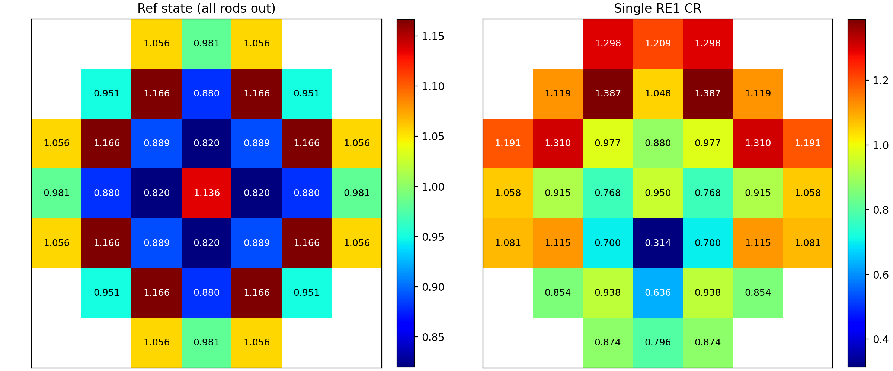

**Fig.10：轴向功率分布**

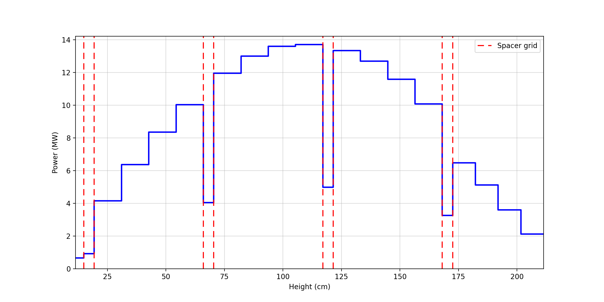

**Fig.11：燃料棒功率分布（Ref/CR）**

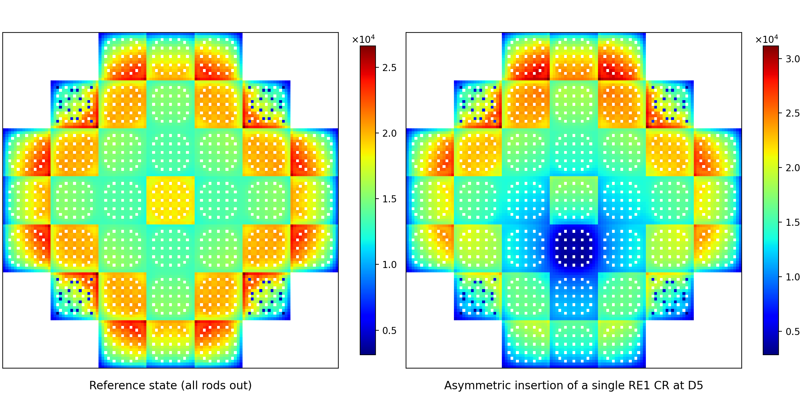

### 02 run keff

<div align="center">
  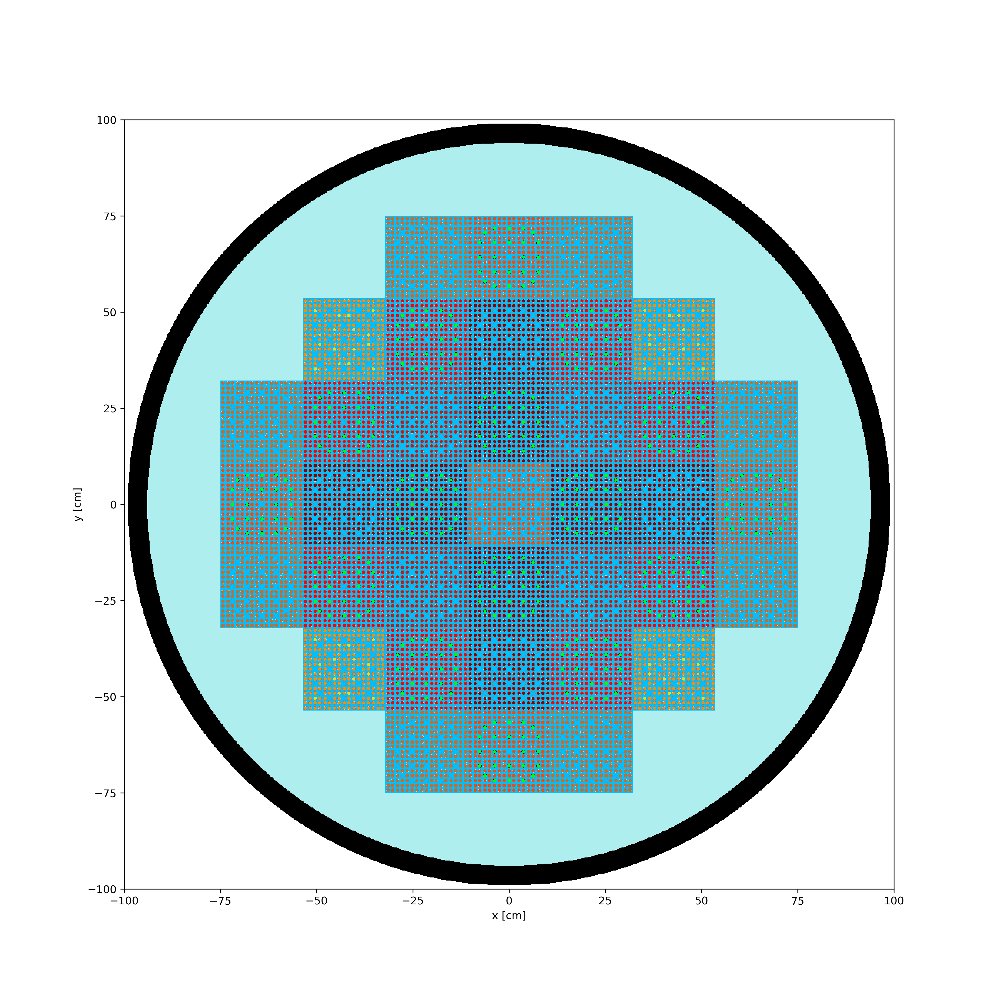
  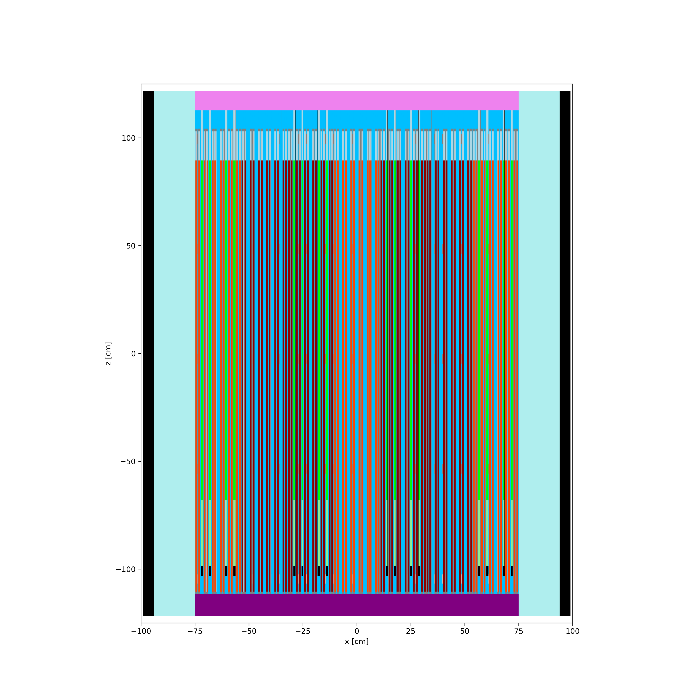
</div>

### 03 tally

```
case                statepoint         k-eff    ref_k-eff  rel_err(%)
------------------  -----------------  -------  ---------  ----------
All rods out (ARO)  statepoint.300.h5  1.02125  1.02768    -0.62592  
RE1 in              statepoint.300.h5  0.99819  1.00723    -0.89718  
RE2 in              statepoint.300.h5  0.99574  1.00313    -0.73718  
SH3 in              statepoint.300.h5  0.98122  0.98978    -0.86458  
SH4 in              statepoint.300.h5  0.98126  0.98971    -0.85368  
All rods in (ARI)   statepoint.300.h5  0.83653  0.85791    -2.49230 
```

**Fig.9/11：径向组件功率分布(RE1 D5 in)**
<div align="center">
  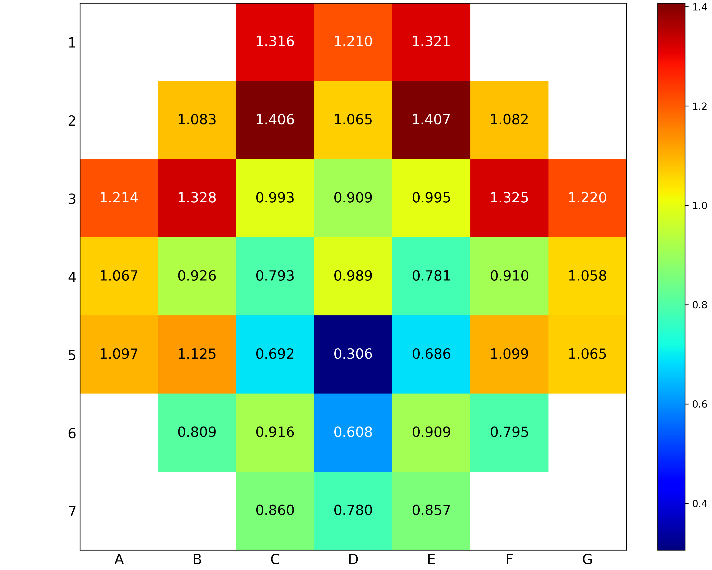
  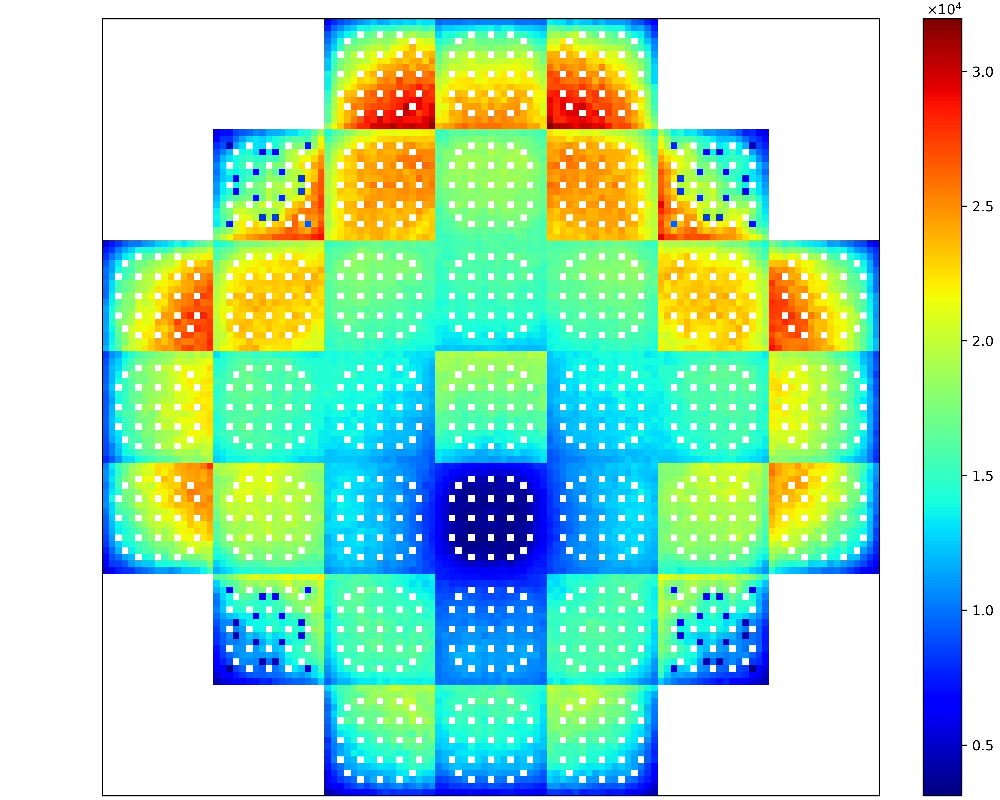
</div>

**Fig.10：轴向功率分布(RE1 D5 in)**
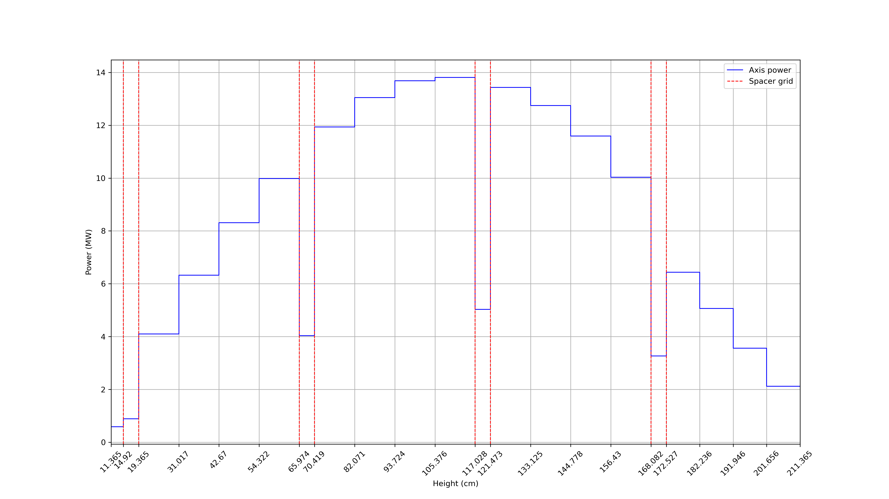


### 04 ERROR 相对误差

**Reference 相对误差（Fig.9 / Fig.10 / Fig.11）**
<div align="center">
  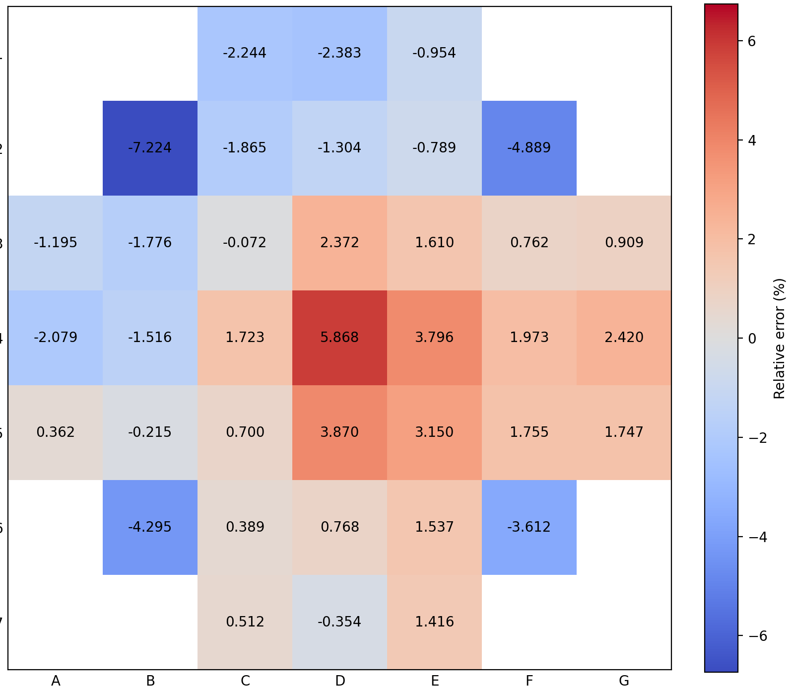
  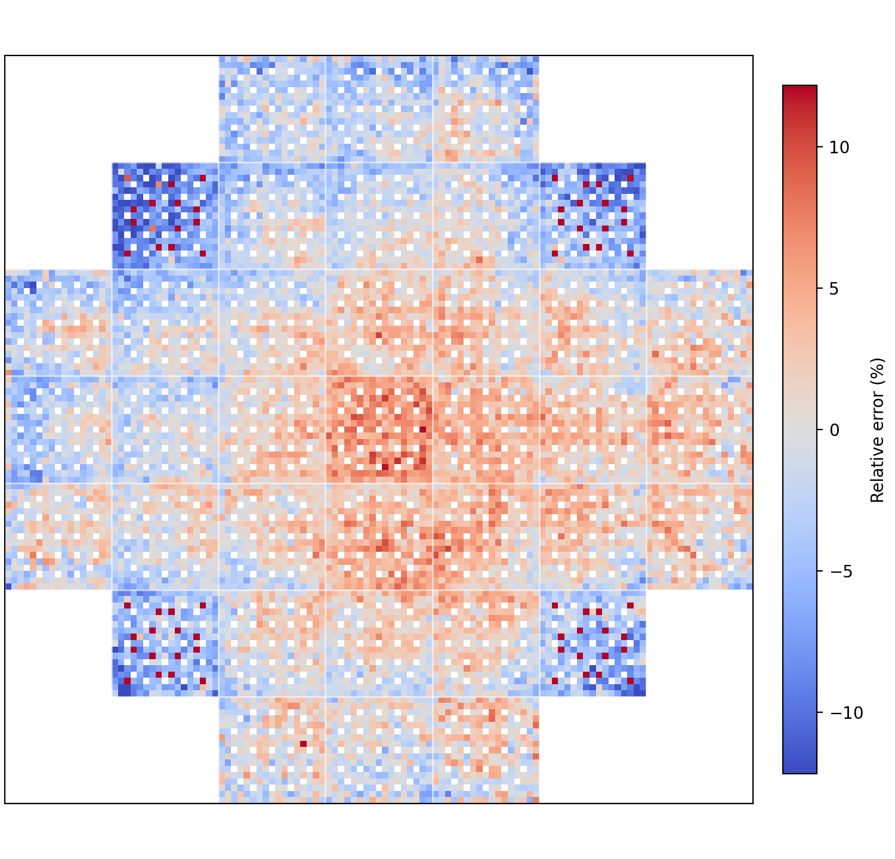
</div>
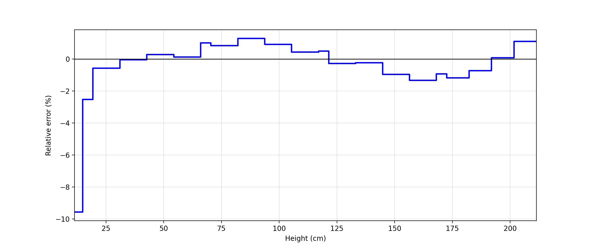

**CR(RE1 in) 相对误差（Fig.9 / Fig.10 / Fig.11）**
<div align="center">
  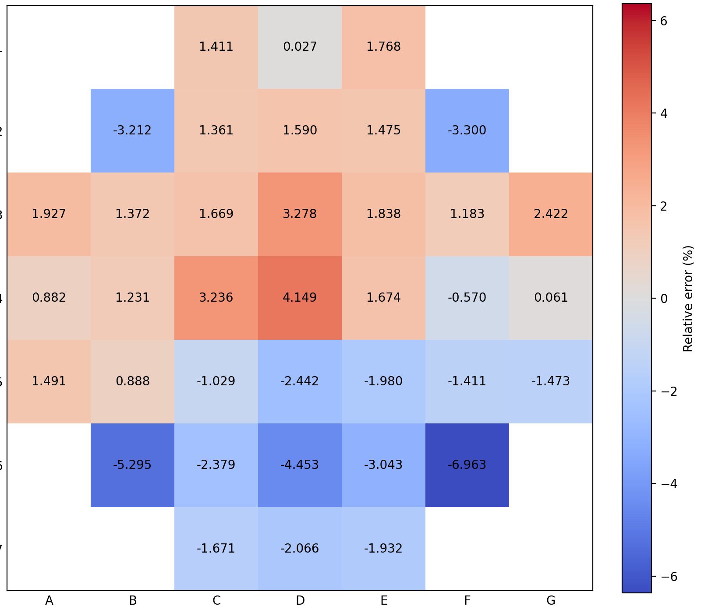
  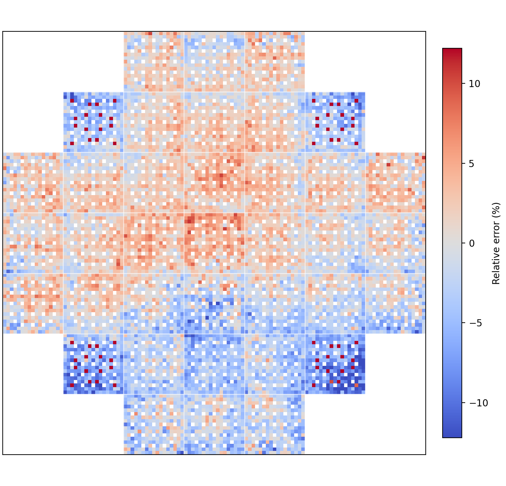
</div>

---

## English

### Project Layout

- `ref/`: reference inputs (e.g. `02-Reference_Solution_v3.xlsx`, benchmark PDF)
- `data/`: OpenMC outputs per case (each folder should contain `statepoint.*.h5`)
  - `data/Reference/` (ARO: All rods out)
  - `data/RE1in/`, `data/RE2in/`, `data/SH3in/`, `data/SH4in/`, `data/SCRAM/`
- `figs/`: generated figures (PNG)
- `*.py`: scripts (model/run/read/plot)

### Requirements

- Python 3
- `numpy`, `pandas`, `matplotlib`, `openpyxl`
- `openmc` (required for reading `statepoint.*.h5`; optional for running simulations)

### Usage

#### 1) Re-plot paper figures from the reference Excel

- Fig.9 (7×7 radial assembly power, Ref/CR side-by-side): `python 01-plotfig9.py`
- Fig.10 (axial power): `python 01-plotfig10.py`
- Fig.11 (pin power, Ref/CR side-by-side): `python 01-plotfig11a.py`

#### 2) Read keff and compute relative error vs. reference

- Script: `python 03-read_keff.py`
- It scans `data/*/statepoint.*.h5` (picks the largest statepoint index), reads `k-eff` from `ref/02-Reference_Solution_v3.xlsx` (`k-eff + CRW` sheet), prints an aligned table, and computes `rel_err(%)`.

#### 3) Read tallies from statepoint and plot (rad/pin/ax)

- Script: `python 03-read_tally.py`

#### 4) Relative error plots (Fig.9 / Fig.10 / Fig.11)

- Reference (ARO): `python 04-error_ref.py`
  - Outputs: `figs/err_fig9_ref.png`, `figs/err_fig10_ref.png`, `figs/err_fig11_ref.png`
- CR (RE1 in): `python 04-error_cr.py`
  - Outputs: `figs/err_fig9_cr.png`, `figs/err_fig10_cr.png`, `figs/err_fig11_cr.png`

Relative error definition: `(calc - ref) / ref * 100%` (cells with NaN/0 reference are masked).

### Notes for GitHub

- `statepoint.*.h5` files can be large; consider Git LFS or keep them out of the repository.
- Please check redistribution licenses for files under `ref/` (especially PDFs / reference solutions) before publishing.
